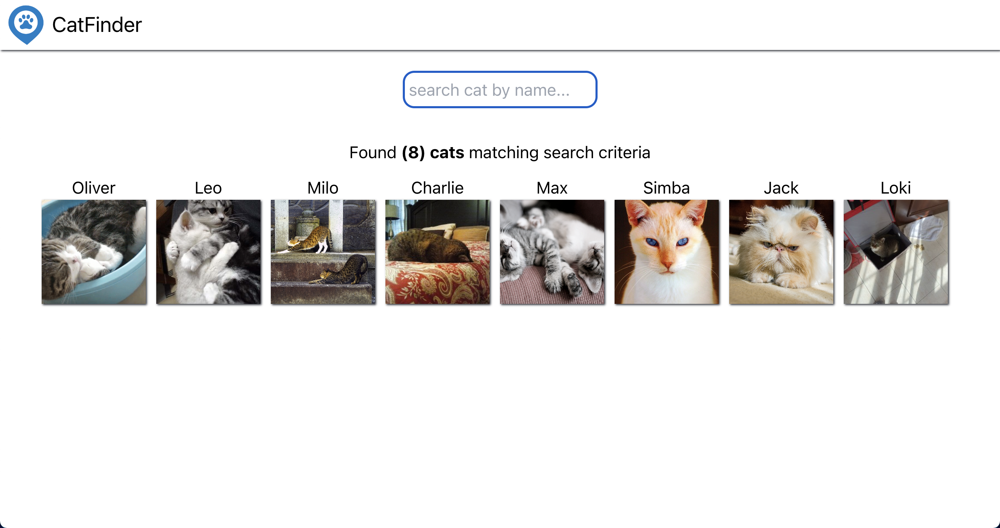

# Pre-requisite
1. NodeJS installed
2. MongoDB cloud access (free tier)

# Getting up and running
1. Create directories `client` and `server`
2. `cd server`
3. RUN `npm init -y`
4. Install packages
   - `dotenv` - to load environmental variables
   - `express` - backend server
   - `cors` - handle cross origin requests
   - `mongodb` - mongodb driver
   - `nodemon` - re-run server after changes
5. `cd ../client`
6. Initialize React project `npx create-react-app .`
7. Install packages
   -  `axios` - make http request

# Starting the app
1. `client` - cd to `client` folder and type `npm start`. Client starts on port `3000`
2. `server` - cd to `server` folder and type `npm start`. Server starts on port `3001`

# What we are building?
A cat finder app having following features
1. List all the Cats
2. Filter cat by name

